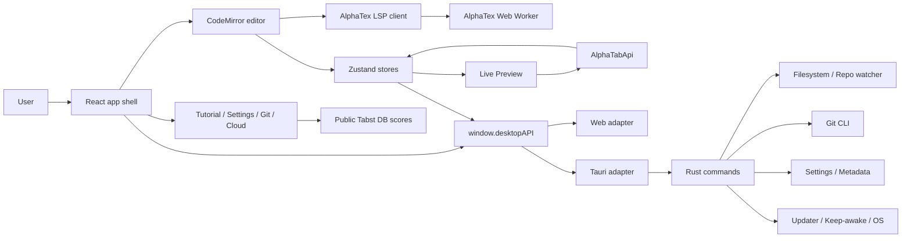

# Tabst Architecture Overview

> **Status:** Current architecture overview
>
> **Scope:** The implementation shipped with this document remains the source
> of truth
>
> **Primary code:** `src/renderer/`, `src-tauri/`, `vite.config.ts`, and
> `.github/workflows/`

## Purpose

Tabst is a plain-text guitar-tab workspace. Users edit AlphaTex source files,
while alphaTab parses, renders, plays, and exports the resulting score. The
application adds the surrounding workspace expected from a modern editor:

- repositories and file trees;
- CodeMirror editing and autosave;
- AlphaTex completion, hover, diagnostics, and source-position mapping;
- live score rendering and playback;
- printing and export;
- themes, commands, shortcuts, and configurable controls;
- optional Git integration;
- tutorials and public cloud-score browsing;
- desktop filesystem and operating-system integration through Tauri;
- a Web runtime built from the same React renderer.

The primary product artifact is the source document, not the rendered score.
An `.atex` file should remain understandable, portable, diffable, and usable
outside Tabst.

## System context



The renderer never treats Tauri as an ambient implementation detail. Desktop
capabilities are exposed through the shared `window.desktopAPI` contract, which
also has a Web implementation. This boundary allows the same components and
stores to operate in desktop and browser builds.

## Repository layout

```text
Tabst.app/
├── src/renderer/
│   ├── components/       # Editor, Preview, settings, Git, Cloud, tutorial UI
│   ├── hooks/            # alphaTab and editor lifecycle ownership
│   ├── lib/              # parsing, commands, persistence, assets, adapters
│   ├── store/            # shared application and theme state
│   ├── workers/          # AlphaTex language worker
│   ├── data/             # commands, ATDOC keys, tutorials, Sandbox content
│   ├── i18n/             # English and Chinese translations
│   └── types/            # shared renderer/desktop payload contracts
├── src-tauri/
│   ├── src/              # Rust command modules and security helpers
│   ├── capabilities/     # Tauri capability declarations
│   └── tauri.conf.json   # desktop build, bundle, CSP, updater configuration
├── public/assets/        # alphaTab fonts, soundfonts, and runtime assets
├── scripts/              # build, bundle, release, vendor, and codemix helpers
├── docs/dev/             # engineering knowledge, guides, plans, and reports
└── .github/workflows/    # CI, website deployment, desktop release workflows
```

`.tmp/notebook-navigator` is an unrelated sandbox and is not part of Tabst's
runtime or build architecture.

## Runtime entry points

### Renderer bootstrap

`src/renderer/main.tsx` is the renderer entry point. It:

1. installs the appropriate `window.desktopAPI` implementation;
2. installs the alphaTab font-warning filter;
3. initializes i18n and the theme provider;
4. decides whether the current URL represents the normal app or a dedicated
   print window;
5. mounts either `App` or `PrintWindow` into the React root.

The print-window decision happens before the main application shell is mounted,
which keeps the print document independent from the live workspace layout.

### Application shell

`src/renderer/App.tsx` owns application-wide composition and effects. It:

- initializes the application store;
- coordinates the Sidebar and global bottom bar;
- switches between workspace modes;
- installs global shortcut and UI-shell command listeners;
- restores application zoom;
- schedules desktop update checks;
- handles drag/drop and paste import for supported Guitar Pro files;
- starts and stops the active repository filesystem watcher;
- filters and debounces filesystem events before refreshing the file tree;
- preloads AlphaTex highlighting and warms the LSP worker during idle time.

The application shell should coordinate global behavior. Domain-specific
parsing, alphaTab lifecycle work, and persistence details belong in stores,
hooks, or library modules rather than accumulating directly in `App.tsx`.

### Tauri entry point

`src-tauri/src/main.rs` delegates to the library runtime. `src-tauri/src/lib.rs`
constructs the Tauri application, installs debug or release plugins, manages
watcher and keep-awake state, and registers all renderer-callable commands.

Debug builds install the MCP bridge plugin. Release builds install the updater
plugin. Command implementation is divided by domain rather than kept in the
entry point.

## Workspace model

Tabst uses a workspace model rather than page-oriented routing. The current
workspace mode is shared state in `appStore` and can be:

| Mode | Purpose |
| --- | --- |
| `editor` | Normal source editor and score preview |
| `enjoy` | Score-focused view that reuses the normal workspace |
| `tutorial` | Built-in MDX documentation and interactive playgrounds |
| `settings` | Appearance, playback, commands, shortcuts, templates, and updates |
| `git` | Git status, diff, stage, pull, and commit workspace |
| `cloud` | Public, read-only cloud-score browsing on desktop |

Mode changes do not create independent application sessions. Repository,
active-file, playback, selection, theme, and command state continue to be owned
by the shared stores.

The UI follows an interaction-zoning convention:

- top and left surfaces provide navigation and context;
- bottom and right surfaces provide frequent commands and playback actions.

The global bottom bar follows a deliberate progression from staff and display
context through playback parameters and progress to transport actions.

## State ownership

### Application store

`src/renderer/store/appStore.ts` is the authoritative source for shared
workspace and session state. Its domains include:

- repository list and active repository;
- file tree, file content, active file, and file metadata;
- expanded folders and workspace restoration;
- editor cursor, score selection, playback beat, and player cursor;
- playback progress, playing state, zoom, speed, volumes, metronome, and count-in;
- staff and track-control configuration;
- workspace mode, settings return mode, tutorial, and Cloud selection;
- Git status, selected change, diff, stage/pull/commit actions;
- command enablement, pinning, MRU, shortcuts, and templates;
- resource asset overrides and configurable player components;
- initialization, repository switching, reconciliation, and persistence
  scheduling.

Components should select the smallest state slice they require. Local component
state is appropriate for transient presentation such as an open dialog or an
input draft, but not for duplicating repository, file, playback, or selection
truth.

`AlphaTabApi` is intentionally excluded from Zustand. It is a mutable,
event-driven external object and is owned through React refs by the component or
hook responsible for its lifecycle. The store exposes typed playback controls
and serializable session state instead.

### Theme store

`src/renderer/store/themeStore.ts` owns UI theme, editor theme, requested
light/dark/system mode, and the resolved effective mode. Theme preferences are
persisted through the shared settings helpers rather than a separate browser
storage system.

## Repository, files, and persistence

A Tabst repository is primarily a workspace root directory. It may also be a
Git repository, but Git is optional. Supported score and documentation files are
represented in the file tree, while `.git` and `.tabst` remain internal.

Desktop persistence has three main layers:

| Data | Location |
| --- | --- |
| Known repository list | Application metadata directory, `repos.json` |
| Global preferences | Application metadata directory, `settings.json` |
| Repository workspace session | `<repo>/.tabst/workspace.json` |

Repository metadata contains workspace-oriented state such as expanded folders,
the active file path, workspace mode, and selected tutorial/settings context.
Global settings contain preferences that should survive repository changes.

Persistence helpers sanitize and migrate existing settings. New persistent
state must first be classified as global, repository-scoped, session-only, or
derived; adding another backend for an existing state domain is discouraged.

### File loading and reconciliation

Directory scans produce a file tree. File content may be loaded lazily through
`desktopAPI.readFile`. When an external filesystem event causes a rescan, the
store reconciles the new tree with existing in-memory file state instead of
blindly replacing every `FileItem`. This preserves loaded content and metadata
where paths still match.

### Autosave

CodeMirror updates write the current document into the application store. The
editor autosave layer schedules filesystem persistence with file-specific
snapshots, avoiding synchronous disk writes on every transaction and reducing
the risk of a delayed save targeting the wrong file after a switch.

## Editor and AlphaTex language pipeline

### Editor workspace

`src/renderer/components/Editor.tsx` is the main file workspace, not merely a
text input. It coordinates:

- the active file and language mode;
- CodeMirror creation and reconfiguration;
- autosave and focus tracking;
- the inline command bar;
- source/preview layout;
- mobile Web stacking;
- Guitar Pro and Markdown presentation;
- enjoy mode;
- Cloud read-only mode;
- the Preview and optional Tracks panel.

CodeMirror read-only behavior is applied through compartments, allowing Cloud
to reuse the complete editor configuration without maintaining a separate code
viewer.

### Language selection

`src/renderer/hooks/useEditorLSP.ts` chooses extensions by file type:

- `.atex` uses the AlphaTex extensions and language client;
- `.md` uses CodeMirror Markdown and line wrapping;
- other text falls back to plain text behavior.

### Worker-based language service

`src/renderer/lib/alphatex-lsp.ts` implements a small JSON-RPC-style client over
a module Web Worker. The worker is created lazily, requests receive numeric IDs,
responses resolve matching promises, and outstanding requests have a timeout.

`src/renderer/workers/alphatex.worker.ts` implements the language methods used
by the editor:

- initialization and capability reporting;
- completion;
- hover;
- diagnostics;
- barline discovery.

The worker builds static command and property registries at module load. Request
handlers reuse these registries to avoid repeated documentation scans during
typing.

Completion and hover data follow this precedence:

1. `src/renderer/data/alphatex-commands.json` local overrides and additions;
2. upstream alphaTab language-server documentation;
3. narrow fallback definitions required for resilient behavior.

This local-first order is a product contract. It lets Tabst correct, enrich, or
stabilize language help independently of an upstream package release.

### ATDOC

ATDOC is Tabst's document-level configuration and metadata syntax embedded in
AlphaTex comments. Its definitions, parsing, completion, hover, and coloring
are distributed across `data/atdoc-keys.ts` and the `lib/atdoc*` modules.

ATDOC may describe metadata, display, playback, color, layout, and track-related
settings without making the document invalid AlphaTex. Language features and
runtime application must use the same definitions so that suggested keys match
actual behavior.

## AlphaTex structure and synchronization

Tabst maps source positions to score concepts such as bars and beats. The
primary implementation is `src/renderer/lib/alphatex-parse-positions.ts`, with
selection, cursor, and playback modules consuming its results.

Structural interpretation is AST-first. AlphaTex supports metadata, multiple
tracks and staves, voices, beat and note properties, comments, barlines, and
non-trivial whitespace, so regex-only parsing is not reliable enough for source
semantics. Guarded fallback parsing exists for compatibility and recovery.

The synchronization directions are:

```text
Preview selection
    → bar/beat range
    → AlphaTex source positions
    → CodeMirror selection/decorations

Editor cursor
    → source offset
    → containing bar/beat
    → Preview Beat navigation and Bar-level highlight when cursor broadcast is enabled

Playback beat
    → store progress and bar/beat state
    → editor/preview decorations when enabled
```

Synchronization settings are user-configurable. Editor cursor broadcast is off
by default, while playback/editor auto-scroll has its own preference. Store
updates should be gated to changed values where practical because cursor and
playback callbacks are high-frequency paths.

Current behavior, feature gates, loop guards, and known Beat/Bar granularity
limitations are documented in
[EDITOR_PREVIEW_SYNC.md](./EDITOR_PREVIEW_SYNC.md).

## Live preview and playback

`src/renderer/components/Preview.tsx` coordinates the live alphaTab session.
The `AlphaTabApi` instance is stored in a ref and is treated as an external
resource with explicit creation, binding, configuration, and destruction.

A simplified lifecycle is:

```text
resolve assets and settings
    → create AlphaTabApi
    → bind listeners
    → apply playback and display configuration
    → load SoundFont
    → call tex(content)
    → render/play/synchronize
    → unbind listeners
    → destroy API
```

Supporting hooks divide lifecycle responsibilities:

- API suspension, destruction, and reinitialization around print mode;
- event binding and bind-token discipline;
- parse timeout and error recovery;
- lifecycle telemetry;
- score selection synchronization;
- bar highlighting.

`src/renderer/hooks/useAlphaTab.ts` contains a separate lifecycle abstraction,
but no production component currently imports it. The live Preview contract is
`Preview.tsx` plus its `usePreview*` hooks and library helpers.

Playback state includes speed, master and metronome volumes, count-in,
metronome-only behavior, playback range/progress, keep-awake integration, and
configurable control visibility.

### Rebuilds

Some alphaTab settings are effectively construction-time settings. Production
theme and resource changes rebuild the API, while content uses `tex()`, staff
model changes use `renderTracks()`, and supported warm settings use
`updateSettings()` plus `render()`.

Deep rebuilds restore current content, zoom, global playback preferences,
SoundFont, listeners, ATDOC settings, mix settings, and the saved first-track
staff configuration where available. They do not restore playing state,
playback position, score selection, or scroll position. The current staff
toggle path also has a known ref-synchronization gap, so staff preservation is
not yet unconditional.

The exact operation table, restoration matrix, host split, and failure recovery
contract are documented in
[PREVIEW_LIFECYCLE.md](./PREVIEW_LIFECYCLE.md). Async callbacks must check that
they still refer to the current API.

## Theme and resource system

The UI theme and CodeMirror theme are registered in
`src/renderer/lib/theme-system/`. CSS variables describe application colors and
the alphaTab score palette. The theme system writes those variables and invokes
an explicit Preview Refresh. `src/renderer/lib/themeManager.ts` reads the
alphaTab-specific variables and also provides a root-class observer fallback.

Runtime score assets include the Bravura music font and SoundFont resources.
The resource catalog and loader resolve URLs appropriate for Web, Tauri, and
print contexts, with sanitized workspace overrides where supported.

Large assets are treated separately from ordinary JavaScript chunks. Vite build
logic excludes configured heavy assets from the default static bundle, so
runtime URL resolution and packaging configuration are part of the playback
contract.

## Command system

Commands are registered centrally rather than implemented independently by
buttons, palettes, and shortcuts.

`src/renderer/lib/command-registry.ts` defines command IDs, metadata,
categories, icons, and command groups. `ui-command-registry.ts` evaluates
availability against current application state and dispatches supported
actions. Component-owned actions are reached through established shell or
preview command events.

This keeps these entry points consistent:

- global command palette;
- inline editor command bar;
- keyboard shortcuts;
- toolbar and bottom-bar controls;
- dynamic ATDOC insertion commands.

New actions must define context availability and disabled behavior before they
are exposed through multiple UI surfaces.

## Desktop bridge

The renderer contract is `window.desktopAPI`, typed in
`src/renderer/types/desktop.d.ts`.

`src/renderer/lib/desktop-api.ts` detects the runtime and installs a compatible
API. In Tauri, `src/renderer/lib/tauri-desktop-api.ts` translates calls into
`invoke` and event subscriptions. In the browser, the Web adapter provides the
supported fallback behavior and the Sandbox workspace model.

The expected cross-boundary change sequence is:

1. define or update shared payload types;
2. implement and validate the Rust command;
3. register it in `src-tauri/src/lib.rs`;
4. expose it through the Tauri adapter;
5. update the renderer desktop contract;
6. update the Web adapter when the method is shared;
7. test invoke arguments and behavior.

Renderer components should not import Tauri APIs directly for ordinary product
operations.

## Tauri runtime and security

Rust commands are grouped by domain:

| Module | Responsibility |
| --- | --- |
| `fs_commands.rs` | Open/select/create/read/write/rename/move/reveal resources |
| `repo_commands.rs` | Scan, repository metadata, deletion, filesystem watcher |
| `git_commands.rs` | Status, diff, stage, pull, and commit through Git CLI |
| `settings_commands.rs` | Global settings persistence |
| `updater_commands.rs` | Version, release feed, update check and installation |
| `power_commands.rs` | Playback keep-awake behavior |
| `models.rs` | Serialized request and response payloads |
| `support.rs` | Shared paths, authorization, JSON, and runtime helpers |

Renderer-provided paths are untrusted. Rust normalizes and authorizes existing
paths and targets against registered repository roots or explicitly allowed
files. Operations reject parent-directory escapes, cross-workspace moves,
out-of-scope deletion, and invalid Git pathspecs.

Tauri CSP, capabilities, Rust authorization, and typed bridge contracts form
separate defense layers. Weakening one layer should not be used as a substitute
for implementing the correct validation in another.

## Repository watching

The active desktop repository can be watched for external filesystem changes.
Rust emits repository change events; `App.tsx` filters events for the current
repository, excludes internal and unsupported paths, suppresses rapid
duplicates, and debounces file-tree refresh.

Watcher ownership follows the active repository. Switching repositories or
unmounting the application must stop the old watcher, remove event listeners,
clear timers, and reset duplicate-event state.

## Git integration

Git is optional and does not define the workspace storage model. When the active
repository is a Git work tree, the Rust runtime invokes the installed Git CLI
and returns typed status and diff results.

The application store owns Git loading, error, selection, diff, and action
state. `GitWorkspace.tsx` renders that state and issues store actions. Status
refresh requests are coordinated so concurrent consumers do not create
unnecessary duplicate work.

Git path arguments are validated in Rust. Repository filesystem watcher events
from `.git` are ignored to avoid refresh loops and excessive rescans.

## Cloud and Web Sandbox

Public scores are fetched from the configured Tabst DB Supabase REST endpoint.
The Cloud feature intentionally has different integration semantics by runtime.

### Desktop

- `cloud` is a dedicated workspace mode.
- `CloudSidebar` lists public score objects.
- `CloudView` loads the selected source into a virtual file.
- The normal `Editor` and `Preview` are reused.
- CodeMirror is configured read-only.
- There is no sign-in, private library, or publish flow.

### Web

- Sandbox remains the primary repository.
- Initialization fetches public scores and creates or updates regular `.atex`
  files inside Sandbox.
- `at.meta.source` records the public object identity.
- Repeated initialization updates matching imports instead of duplicating them.

These two behaviors should not be collapsed unless the product model changes;
they solve different constraints while sharing the same editor and preview
experience.

## Print pipeline

Printing uses a dedicated entry point and a dedicated `AlphaTabApi`. It does not
borrow the live Preview API because page layout, tracks, scale, fonts, and
window lifecycle differ from the interactive workspace.

The main pieces are:

- `PrintWindow.tsx` for the independent print document;
- `PrintPreview.tsx` for the print alphaTab lifecycle and pagination;
- `PrintTracksPanel.tsx` for print-specific track and display configuration;
- `print-utils.ts`, `pagination.ts`, `print-fonts.ts`, and `print-window.ts` for
  reusable sizing, resource, and window behavior.

The print context preserves an established font contract: `.at` uses a `34px`
font size and Bravura must load through a URL valid for the independent print
document.

## Tutorials and documentation content

Tutorials are MDX documents loaded by the renderer. They support localized
content, Markdown components, code blocks, and interactive AlphaTex playgrounds.
Vendor-derived AlphaTex material lives alongside Tabst-authored onboarding and
ATDOC guidance but is tracked through registry and synchronization data.

Tutorial content is a product surface. User-visible prose should remain
localized and links or imports should be verified when files are reorganized.

## Build and delivery topology

Vite builds the renderer from the repository root and writes `dist/`. It also:

- supports React and MDX;
- emits ES module workers;
- rewrites development entry requests to the renderer HTML;
- copies selected root documentation into public assets;
- separates alphaTab, CodeMirror, UI, and syntax-highlighting vendor chunks;
- chooses Tauri browser targets by platform;
- removes configured heavy public assets from the default output.

Tauri uses the same Web build as its frontend distribution. `tauri.conf.json`
defines the dev server, frontend output, window, CSP, bundle resources, icons,
and updater endpoints.

Repository automation currently includes:

- renderer linting and macOS Tauri build validation in CI;
- Tauri verification and performance/bundle thresholds;
- GitHub Pages deployment for the Web build;
- an enabled macOS desktop release workflow;
- present but paused Windows and Linux release workflows.

The workflow files are the source of truth for current publishing availability.

## Error handling and performance boundaries

The most performance-sensitive paths are editor updates, completion and hover,
source-position mapping, playback callbacks, preview rebuilds, and filesystem
watch events.

Existing strategies include:

- prebuilt command/property registries;
- lazy Worker creation plus idle prewarming;
- debounced autosave and filesystem refresh;
- duplicate watcher-event suppression;
- playback frame gating and range caching;
- store updates only when values change;
- API identity and bind-token checks for stale callbacks;
- parse timeout and recovery paths;
- lifecycle telemetry for preview initialization and rebuilds.

New work in these paths should avoid repeated full-document scans, per-frame
large allocations, duplicate listeners, and unbounded caches.

## Architectural invariants

The following rules are deliberate contracts, not incidental implementation
details:

1. AlphaTex source remains the primary document truth.
2. Shared workspace and playback state has one Zustand source of truth.
3. Mutable `AlphaTabApi` instances live in refs with explicit ownership.
4. Deep alphaTab changes use destroy/recreate with state restoration.
5. Print and live preview use independent API instances.
6. AlphaTex structure is interpreted through AST semantics where available.
7. Local completion and hover data override upstream documentation.
8. Desktop capabilities are accessed through `window.desktopAPI`.
9. Rust validates all renderer-provided paths and command inputs.
10. Commands use central registration and availability checks.
11. Desktop Cloud is read-only; Web public scores integrate with Sandbox.
12. Every listener, timer, worker, watcher, and external API has deterministic
    cleanup.

## High-complexity areas

Several modules have high fan-in or own lifecycle-heavy behavior:

- `store/appStore.ts` coordinates most shared state, persistence, and async
  workspace actions;
- `components/Preview.tsx` coordinates the live alphaTab and playback session;
- `components/Editor.tsx` composes CodeMirror, Preview, and file-mode behavior;
- `components/Sidebar.tsx` combines repository, file, navigation, and mode UI;
- `components/GlobalBottomBar.tsx` combines configurable playback controls;
- `workers/alphatex.worker.ts` is the editor-language hot path.

Refactoring these files should preserve state ownership and lifecycle contracts.
Moving shared state into unrelated component-local state is not a valid
decomposition strategy. Prefer extracting typed domain helpers, pure parsing,
controllers, and focused hooks while retaining a clear single owner.

## Change map

| Change | Start here | Also inspect |
| --- | --- | --- |
| App mode or shell behavior | `App.tsx` | `appStore.ts`, Sidebar, commands |
| Editor behavior | `Editor.tsx` | editor extensions, autosave, LSP hook |
| Completion/hover/diagnostics | `alphatex.worker.ts` | command data, ATDOC definitions, LSP client |
| Source/score synchronization | `alphatex-parse-positions.ts` | selection, cursor, playback sync modules |
| Preview or playback | `Preview.tsx` | `usePreview*`, playback/audio helpers |
| Theme behavior | `theme-system/`, `themeStore.ts` | ThemeProvider, themeManager, Preview rebuild |
| Print behavior | `PrintPreview.tsx` | print helpers, PrintWindow, PrintTracksPanel |
| Commands or shortcuts | `command-registry.ts` | UI registry, events, palettes, shortcut manager |
| Repository persistence | `appStore.ts` | metadata store, repo/settings Rust commands |
| Desktop API | shared types and Rust command | Tauri adapter, Web adapter, invoke tests |
| Git | `git_commands.rs` | appStore Git actions, GitWorkspace, diff parser |
| Cloud | `cloud-public-scores.ts` | CloudSidebar, CloudView, Sandbox initialization |
| Build or release | `package.json`, Vite/Tauri config | scripts and workflows |

## Related documentation

- `docs/dev/README.md` — development-document index.
- `docs/dev/architecture/PREVIEW_LIFECYCLE.md` — current alphaTab host,
  lifecycle, rebuild, state restoration, and staff configuration contract.
- `docs/dev/architecture/EDITOR_PREVIEW_SYNC.md` — current source/score,
  selection, cursor, and playback synchronization contract.
- `docs/dev/runbooks/DEBUG_ALPHATAB.md` — alphaTab troubleshooting procedures.
- `docs/dev/alphatex/` — AlphaTex LSP and ATDOC design material.
- `docs/dev/ops/` — updater, security, and operational notes.
- `docs/dev/roadmap/` — feature plans that are not current implementation.
- `docs/dev/archived/` — historical runtime and completed migration context.

When a related document conflicts with the implementation, verify the source
code and update or mark the document historical. Architecture documentation
should describe current behavior; plans and reports should state their status
explicitly.
